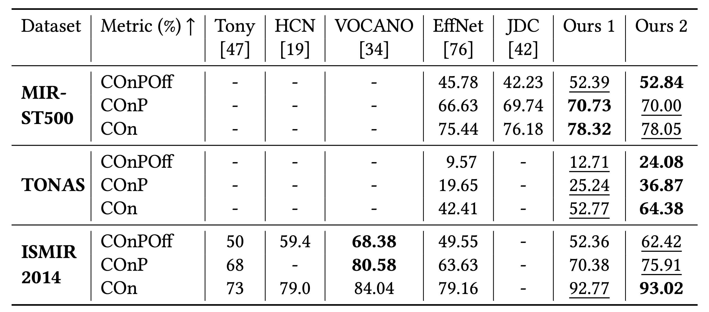

# Audio-only Singing Voice Transcription with MIR-ST500 dataset
This sub-project contains recipes for trianing benchmark SVT system using MIR-ST500 dataset.

## Prerequisites
1. Before running our scripts, you need to download, preprocess and save the datasets properly. For polyphonic singing recordings, we use [spleeter](https://github.com/deezer/spleeter) to extract the vocal part. Besides, to meet the requirements of self-supervised-learning models in our project, we resample the audio data into 16 kHz. We provide sample code in `prepare_benchmarks.py`. For the annotations, we save them to a json file. 

The file organization for MIR-ST500 should be:
```
/path/to/MIR_ST500
├── wav16kHz
    ├── train
        ├── song1
            ├── vocals.wav
        ├── song2
        ├── ...
    ├── test
├── Annotations.json
```

The file organization for ISMIR and TONAS should be:
```
/path/to/ISMIR or /path/to/TONAS
├── wav16kHz
    ├── song1
        ├── vocals.wav
    ├── song2
    ├── ...
├── Annotations.json
```


2. Prepare benchmark SVT datasets including MIR-ST500, TONAS, and ISMIR2014, run:
```
python prepare_benchmarks.py --duration <duration> --frame_rate 49.8 --mir_st500 /path/to/MIR_ST500 --ismir /path/to/ISMIR2014 --tonas /path/to/TONAS
```
The option `--duration` refers to the length of utterances during the training. To parallelize the training, we split the whole song into short utterances during the training. The evaluation is conducted on the whole song. As a default, we use `5` s in our paper. The option `--frame_rate` refers to the frame rate of frame-level annotations. As a default, we use `49.8` fps, which is the frame rate of wav2vec 2.0 features.

After running this script, the file organization for MIR-ST500 should be:
```
/path/to/MIR_ST500
├── wav16kHz
    ├── train
        ├── song1
            ├── vocals.wav
            ├── annotation.json
            ├── frame_anno.npy
        ├── song2
        ├── ...
    ├── test
├── Annotations.json
```

The file organization for ISMIR and TONAS should be:
```
/path/to/ISMIR or /path/to/TONAS
├── wav16kHz
    ├── song1
        ├── vocals.wav
        ├── annotation.json
        ├── frame_anno.npy
    ├── song2
    ├── ...
├── Annotations.json
```

The resulted csv files are save in the same root folder: 
```
├── data
    ├── dur_<duration>
        ├── mir_st500_train.csv
        ├── mir_st500_test.csv
        ├── ismir2014.csv
        ├── tonas.csv
├── prepare_benchmarks.py
```

## How to run
We provide basic runnning scripts for those who intend to follow our research. You can change the hyperparameters or even the types of self-supervised-learning (SSL) models in your own project. To reproduce `ours variant 1` in our paper, run:
```
CUDA_VISIBLE_DEVICES=0,1 python train_audio_ssl.py hparams/train_audio_ssl.yaml --data_parallel_backend --data_folder /path/to/MIR_ST500 --attempt 1 --dur_threshold 5 --linear_prob_epochs 2 --number_of_epochs 10 --ssl_model wav2vec2-large-lv60
```
The option `--linear_prob_epochs` refers to the number of epochs for linear probing in our paper. The option `--ssl_model` refers to the self-supervised-learning (SSL) model we used. Although we use data parallel (DP) in our experiments, we also provide distributed data parallel (DDP) version (remember to change the `batch_size` to avoid OOM):
```
CUDA_VISIBLE_DEVICES=0,1 python -m torch.distributed.launch --nproc_per_node=2 train_audio_ssl.py hparams/train_audio_ssl.yaml --distributed_launch --distributed_backend='nccl' --find_unused_parameters --data_folder /path/to/MIR_ST500 --attempt 1 --dur_threshold 5 --linear_prob_epochs 2 --number_of_epochs 10 --ssl_model wav2vec2-large-lv60
```

NOTE: For SSL models, we used `wav2vec2-large-lv60` as the wav2vec 2.0 pretrained on speech data and `wav2vec2-large-960h-lv60-self` as the wav2vec 2.0 pretrained and finetuned on speech data. To facilitate the follow-up research, our repo supports the following SSL models: [wav2vec2](https://arxiv.org/abs/2006.11477), [HuBERT](https://arxiv.org/abs/2106.07447), [data2vec](https://arxiv.org/abs/2202.03555), [WavLM](https://arxiv.org/abs/2110.13900). Please find the checkpoint name in [Huggingface](https://huggingface.co/models).

## Results
We provide our trained SVT model of `ours variant 1`[[model link](https://drive.google.com/drive/folders/18IvMt8vrtZewCjCSy6DTPfZzhJw4SI95?usp=sharing)] in the paper.
<p align="center">

</p>