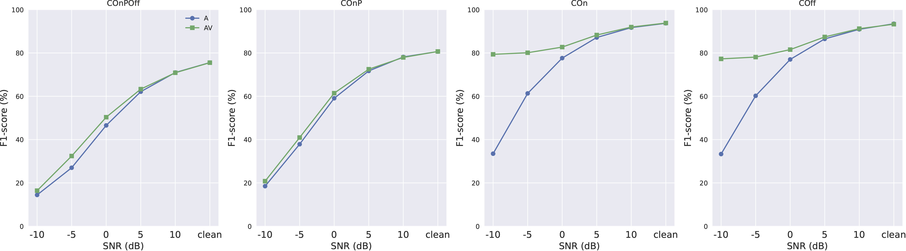

# Audio-Visual Automatic Music Transcription with N20EMv2 dataset
This sub-project contains recipes for training audio-visual AMT system using N20EMv2 dataset.

## Prerequisites
Before running our scripts, you need to simulate the noisy environments by synthesizing the noisy data. We provide the synthesized noisy data in N20EMv2. If you want to obtain these data from scratch, you can follow the procedure.

Firstly, you should download and decompress the [MUSAN](https://www.openslr.org/17/). Assmue you save the data in `/path/to/MUSAN`, which contains the following folders `./music, ./speech, ./noise`. We borrow the code from [AVHuBERT](https://github.com/facebookresearch/av_hubert/tree/main/avhubert/preparation) to process the MUSAN dataset. Run the following code:
```
python prepare_musan.py --musan /path/to/MUSAN --nshard <nshard>  --slurm_partition <slurm_partition>
```
This will: (1) split raw audios into 10-second clips, (2) generate babble noise from MUSAN speech audio, (3) count number of frames per clip. The whole data will be sharded into ${nshard} parts and each job processes one part.

Next, we synthesize the noisy data considering four noise types, including `accomp`, `babble`, `white`, `natural`, and five noise levels, including `-10dB`, `-5dB`, `0dB`, `5dB`, `10dB`. Run the following code:
```
python synthesis_noise.py --musan /path/to/MUSAN --n20emv2 /path/to/N20EMv2
```

The file organization for N20EMv2 should be:
```
/path/to/N20EMv2
├── data
    ├── song1
        ├── vocals.wav
        ├── accomp.wav
        ├── video_50fps.npy
        ├── note_anno.json
        ├── audio_anno
        ├── video_anno
        ├── noise_data
            ├── accomp
                ├── SNR_-10dB.wav
                ├── SNR_-5dB.wav
                ├── SNR_0dB.wav
                ├── SNR_5dB.wav
                ├── SNR_10dB.wav
            ├── babble
                ├── ...
            ├── natural
                ├── ...
            ├── white
                ├── ...
    ├── song2
    ├── ...
├── annotations.json
```


## How to run
1. Firstly, we train our audio-only AMT system (check `N20EMv2/audio_only/README.md`) and video-only AMT system (check `N20EMv2/video_only/README.md`). Make sure the model are well saved in order to extract features as follows.

2. Secondly, we fix the gradients of audio encoder and video encoder. Practically, we extract the acoustic features from audio-only AMT system. To do so, run following commands:
```
cd N20EMv2/audio_only
CUDA_VISIBLE_DEVICES=0,1 python extract_ssl_feats.py hparams/extract_ssl_feats.yaml --data_parallel_backend --mix_train True --data_folder /path/to/N20EMv2 --attempt 1 --dur_threshold 5 --linear_prob_epochs 2 --number_of_epochs 10 --ssl_model wav2vec2-large-lv60 --save_model True --add_noise True --noise_type <noise_type> --snr_db <snr_db> 
```
Compared to the run script, we enable four extra options. `--add_noise` refers to noisy input or clean input, `--noise_type` refers to the type of noise, including `accomp`, `babble`, `white`, `natural`, while `--snr_db` refers to the noise level, including `-10`, `-5`, `0`, `5`, `10` dB. Finally, `--save_model==True` means that we will save the SSL model and AMT classifier to the folder `N20EMv2/save_model` 

Then we extract the visual features from video-only AMT system. To do so, run following commands:
```
CUDA_VISIBLE_DEVICES=0,1 python extract_ssl_feats.py hparams/extract_ssl_feats.yaml --data_parallel_backend --data_folder /path/to/N20EMv2 --attempt 1 --dur_threshold 5 --linear_prob_epochs 2 --number_of_epochs 10
```

3. Prepare csv files for N20EMv2 feats, run:
```
python prepare_n20emv2.py --duration <duration> --n20emv2 /path/to/n20emv2
```

4. Run the second training stage of audio-visual AMT system, run:
```
CUDA_VISIBLE_DEVICES=0,1 python train_rca_av.py hparams/train_rca_av.yaml --data_folder /path/to/N20EMv2 --lr 0.003 --add_noise True --snr_db <snr_db> --noise_type <noise_type> --data_parallel_backend
```
We also provide counterpart audio-only AMT system trained via two stages, run:
```
CUDA_VISIBLE_DEVICES=0,1 python train_rca_a.py hparams/train_rca_a.yaml --data_folder /path/to/N20EMv2 --lr 0.003 --add_noise True --snr_db <snr_db> --noise_type <noise_type> --data_parallel_backend
```

## Results

Results on N20EMv2 dataset for audio-visual / audio-only AMT task under the perturbation of musical accompaniments:

<p align="center">

</p>