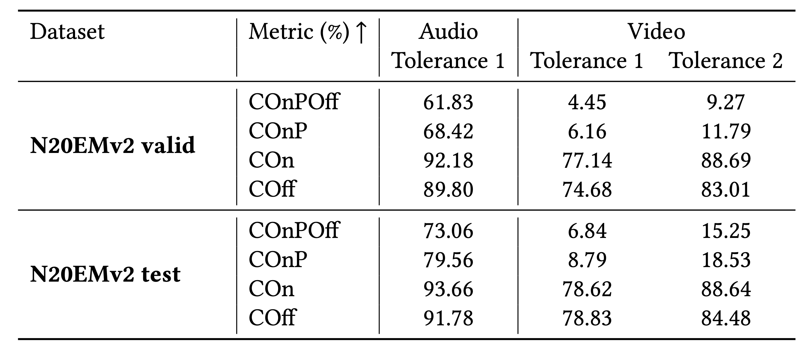

# Video-only Automatic Music Transcription with N20EMv2 dataset
This sub-project contains recipes for trianing video-only AMT system using N20EMv2 dataset.

## Prerequisites
1. Before running our scripts, you need to download, preprocess and save the N20EMv2 properly. For your convenience, we already crop the video clips of lip movements without releasing the identity of each subject.

The file organization for N20EMv2 should be:
```
/path/to/N20EMv2
├── data
    ├── song1
        ├── vocals.wav
        ├── video_50fps.npy
    ├── song2
    ├── ...
├── annotations.json
```


2. Prepare N20EMv2 dataset, run:
```
python prepare_n20emv2.py --duration <duration> --frame_rate 50 --n20emv2 /path/to/n20emv2
```

The option `--duration` refers to the length of utterances during the training. To parallelize the training, we split the whole song into short utterances during the training. The evaluation is conducted on the whole song. As a default, we use `5` s, which is the same as audio-only automatic music transcription. The option `--frame_rate` refers to the frame rate of frame-level annotations. As a default, we use `50` fps, which is also the frame rate of video input.

After running this script, the file organization for N20EMv2 should be:
```
/path/to/N20EMv2
├── data
    ├── song1
        ├── vocals.wav
        ├── video_50fps.npy
        ├── note_anno.json
        ├── video_anno
            ├── 50fps
                ├── video_frame_anno.npy
    ├── song2
    ├── ...
├── annotations.json
```

The resulted csv files are save in the same root folder: 
```
├── data
    ├── frame_rate<frame_rate>
        ├── dur_<duration>
            ├── n20emv2_train.csv
            ├── n20emv2_valid.csv
            ├── n20emv2_test.csv
├── prepare_n20emv2.py
```

## How to run
We provide basic runnning scripts for those who intend to follow our research. You can change the hyperparameters or even the types of self-supervised-learning (SSL) models in your own project. To reproduce video-only sing voice transcription model in our paper, first download the AV-HuBERT model pretrained on audio-visual data:
```
mkdir ssl_model/AVHuBERT
cd ssl_model/AVHuBERT
wget https://dl.fbaipublicfiles.com/avhubert/model/lrs3_vox/clean-pretrain/large_vox_iter5.pt
```

Then run the following command:
```
CUDA_VISIBLE_DEVICES=0,1 python train_video_ssl.py hparams/train_video_ssl.yaml --data_parallel_backend --data_folder /path/to/N20EMv2 --attempt 1 --dur_threshold 5 --linear_prob_epochs 2 --number_of_epochs 10
```
The option `--linear_prob_epochs` refers to the number of epochs for linear probing in our paper. We provide the config for AVHuBERT pretrained on audio-visual speech data. If you intend to use the config for AVHuBERT pretrained and finetuned on audio-visual speech data, please rewrite `hparams/train_video_ssl.yaml` to change the model. Although we use data parallel (DP) in our experiments, we also provide distributed data parallel (DDP) version (remember to change the `batch_size` to avoid OOM):
```
CUDA_VISIBLE_DEVICES=0,1 python -m torch.distributed.launch --nproc_per_node=2 train_video_ssl.py hparams/train_video_ssl.yaml --distributed_launch --distributed_backend='nccl' --find_unused_parameters --data_folder /path/to/N20EMv2 --attempt 1 --dur_threshold 5 --linear_prob_epochs 2 --number_of_epochs 10
```


## Results
We provide our video-only automatic music transcription model [[model link](https://drive.google.com/drive/folders/1u82GaLM4AWtfp5VzDHryxCNUZglN0bYe?usp=sharing)] in the paper.
<p align="center">

</p>