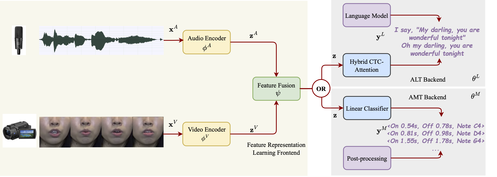

# Automatic Lyric Transcription and Automatic Music Transcription from Multimodal Singing
This is the author's official PyTorch implementation for our TOMM paper:

[Automatic Lyric Transcription and Automatic Music Transcription from Multimodal Singing]()

As this paper is a journal extension of our previous paper on [multimodal ALT](https://dl.acm.org/doi/10.1145/3503161.3548411), we only include the code regarding AMT in this repo. Please refer to the [code](https://github.com/guxm2021/MM_ALT) repo for ALT.


## Project Description
Automatic lyric transcription (ALT) refers to transcribing singing voices into lyrics while automatic music transcription (AMT) refers to transcribing singing voices into note events, i.e., musical MIDI notes. Despite these two tasks having significant potential for practical application, they are still nascent. This is because the transcription of lyrics and note events solely from singing audio is notoriously difficult due to the presence of noise contamination, e.g., musical accompaniment, resulting in a degradation of both the intelligibility of sung lyrics and the recognizability of sung notes. To address this challenge, we propose a general framework for implementing multimodal ALT and AMT systems. Additionally, we curate the first multimodal singing dataset, comprising N20EMv1 and N20EMv2, which encompasses audio recordings and videos of lip movements, together with ground truth for lyrics and note events. For model construction, we propose adapting self-supervised learning models from the speech domain as acoustic encoders and visual encoders to alleviate the scarcity of labeled data. We also introduce a residual cross-attention mechanism to effectively integrate features from the audio and video modalities. Through extensive experiments, we demonstrate that our single-modal systems exhibit state-of-the-art performance on both ALT and AMT tasks. Subsequently, through single-modal experiments, we also explore the individual contributions of each modality to the multimodal system. Finally, we combine these and demonstrate the effectiveness of our proposed multimodal systems, particularly in terms of their noise robustness. 

## Method Overview
The following figure illustrates the framework of our multimodal ALT system or multimodal AMT system.
<p align="center">

</p>

## Installation
### Environement
Install Anaconda and create the environment with python 3.8.12, pytorch 1.9.0 and cuda 11.1:
```
conda create -n amt python=3.8.12
conda activate amt
pip install torch==1.9.1+cu111 torchvision==0.10.1+cu111 torchaudio==0.9.1 -f https://download.pytorch.org/whl/torch_stable.html
```

### SpeechBrain

We run experiments based on [SpeechBrain toolkit](https://github.com/speechbrain/speechbrain). For simiplicity, we remove the original recipes. To install SpeechBrain, run following commands:
```
cd SVT_SpeechBrain
pip install -r requirements.txt
pip install --editable .
```

[Transformers](https://github.com/huggingface/transformers) and other packages are also required:
```
pip install -r dependencies.txt
```

### AV-Hubert
We adapt [AV-Hubert (Audio-Visual Hidden Unit BERT)](https://github.com/facebookresearch/av_hubert) in our experiments. To enable the usage of AV-Hubert, run following commands:
```
cd ..
git clone https://github.com/facebookresearch/av_hubert.git
cd av_hubert
git submodule init
git submodule update
```

[Fairseq](https://github.com/facebookresearch/fairseq) and dependencies are also required:
```
pip install -r requirements.txt
cd fairseq
pip install --editable ./
```

## Datasets
### MIR-ST500
[MIR-ST500 dataset](https://ieeexplore.ieee.org/document/9414601) is the largest AMT dataset for singing with manual annotations. MIR-ST500 has 500 Chinese pop songs (about 30 hours) including 400 songs for training and 100 songs for evaluation. To download and prepare this dataset, we follow its github website https://github.com/york135/singing_transcription_ICASSP2021. 

### TONAS
[TONAS dataset](https://www.jstor.org/stable/24265468) is a evaluation set for AMT for singing. TONAS has 72 Flamenco songs (36 minutes in total duration). We download the dataset from this website https://www.upf.edu/web/mtg/tonas.


### ISMIR2014
[ISMIR2014 dataset](https://riuma.uma.es/xmlui/bitstream/handle/10630/8372/298_Paper.pdf?sequence=1) is another evaluation set for AMT for singing. ISMIR2014 has 14 songs sung by children, 13 by male adults and 11 by female adults (38 pop songs, 19 minutes in total duration). 

### N20EMv2
N20EMv2 dataset is curated by ourselves for our multimodal AMT task. We will release the dataset soon.


NOTE: 
* When evaluating audio-only AMT systems, please make sure the audio input to model is 16 kHz and has mono channel. We use [spleeter](https://github.com/deezer/spleeter) to extract the vocal part. 
* When evaluating video-only AMT systems, please make sure the video input to model is 50 fps. 
* When evaluating audio-visual AMT systems, please proceed to `N20EMv2/audio_visual` to check how to simulate noisy environments.


## Training and Evaluation
We follow the internal logic of SpeechBrain, you can run experiments in this way:
```
cd <dataset>/<task>
python experiment.py params.yaml
```
You may need to create csv files according to our guidance in `<dataset>/<task>`. The results will be saved in the `output_folder` specified in the yaml file. Both detailed logs and experiment outputs are saved there. Furthermore, less verbose logs are output to stdout.

## Citation

```BibTex
@article{gu2024automatic,
      title={Automatic Lyric Transcription and Automatic Music Transcription from Multimodal Singing}, 
      author={Gu, Xiangming and Ou, Longshen and Zeng, Wei and Zhang, Jianan and Wong, Nicholas and Wang, Ye},
      journal={ACM Transactions on Multimedia Computing, Communications and Applications},
      year={2024}
}

@article{gu2023deep,
  title={Deep audio-visual singing voice transcription based on self-supervised learning models},
  author={Gu, Xiangming and Zeng, Wei and Zhang, Jianan and Ou, Longshen and Wang, Ye},
  journal={arXiv preprint arXiv:2304.12082},
  year={2023}
}
```
We borrow the code from [SpeechBrain](https://arxiv.org/pdf/2106.04624.pdf), please also consider citing their works.


## Also Check Our Relevant Work
**MM-ALT: A Multimodal Automatic Lyric Transcription System**<br>
Xiangming Gu*, Longshen Ou*, Danielle Ong, Ye Wang<br>
*ACM International Conference on Multimedia (ACM MM), 2022, (Oral)*<br>
[[paper](https://guxm2021.github.io/pdf/ACMMM2022.pdf)][[code](https://github.com/guxm2021/MM_ALT)]

**Elucidate Gender Fairness in Singing Voice Transcription**<br>
Xiangming Gu, Wei Zeng, Ye Wang <br>
*ACM International Conference on Multimedia (ACM MM), 2023*<br>
[[paper](https://guxm2021.github.io/pdf/ACMMM2023.pdf)]


## License
SVT_SpeechBrain is released under the Apache License, version 2.0.
