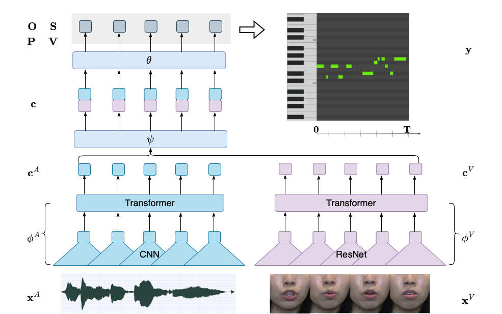
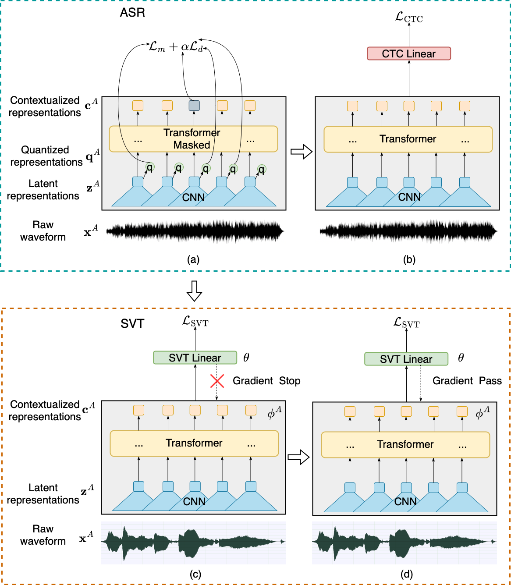

# Deep Audio-Visual Singing Voice Transcription based on Self-Supervised Learning Models
This is the author's official PyTorch implementation for AV_SVT. The paper is under review.

[Deep Audio-Visual Singing Voice Transcription based on Self-Supervised Learning Models]()


## Project Description
Singing voice transcription converts recorded singing audio to musical notation. Sound contamination (such as accompaniment) and lack of annotated data make singing voice transcription an extremely difficult task. We take two approaches to tackle the above challenges: 1) introducing multimodal learning for singing voice transcription together with a new multimodal singing dataset, N20EMv2, enhancing noise robustness by utilizing video information (lip movements to predict the onset/offset of notes), and 2) adapting self-supervised learning models from the speech domain to the singing voice transcription task, significantly reducing annotated data requirements while preserving pretrained features. We build a self-supervised learning based audio-only singing voice transcription system, which not only outperforms current state-of-the-art technologies as a strong baseline, but also generalizes well to out-of-domain singing data. We then develop a self-supervised learning based video-only singing voice transcription system that detects note onsets and offsets with an accuracy of about 80%. Finally, based on the powerful acoustic and visual representations extracted by the above two systems as well as the feature fusion design, we create an audio-visual singing voice transcription system that improves the noise robustness significantly under different acoustic environments compared to the audio-only systems.

## Method Overview
The following figure shows the overview of our audio-visual singing voice transcription system.
<p align="center">

</p>

The following figure shows the training procedure of single-modaly singing voice transcription system based on Linear Probing-Full Finetuning.
<p align="center">

</p>

## Installation
### Environement
Install Anaconda and create the environment with python 3.8.12, pytorch 1.9.0 and cuda 11.1:
```
conda create -n svt python=3.8.12
pip install torch==1.9.1+cu111 torchvision==0.10.1+cu111 torchaudio==0.9.1 -f https://download.pytorch.org/whl/torch_stable.html
```

### SpeechBrain

We run experiments based on [SpeechBrain toolkit](https://github.com/speechbrain/speechbrain). For simiplicity, we remove the original recipes. To install SpeechBrain, run following commands:
```
cd AV_SVT
pip install -r requirements.txt
pip install --editable .
```

[Transformers](https://github.com/huggingface/transformers) and other packages are also required:
```
pip install -r dependencies.txt
```
## Datasets
### MIR-ST500
[MIR-ST500 dataset](https://ieeexplore.ieee.org/document/9414601) is the largest singing voice transcription dataset with manual annotations. MIR-ST500 has 500 Chinese pop songs (about 30 hours) including 400 songs for training and 100 songs for evaluation. To download and prepare this dataset, we follow its github website https://github.com/york135/singing_transcription_ICASSP2021. 

### TONAS
[TONAS dataset](https://www.jstor.org/stable/24265468) is a evaluation set for singing voice transcription dataset. TONAS has 72 Flamenco songs (36 minutes in total duration). We download the dataset from this website https://www.upf.edu/web/mtg/tonas.


### ISMIR2014
[ISMIR2014 dataset](https://riuma.uma.es/xmlui/bitstream/handle/10630/8372/298_Paper.pdf?sequence=1) is another evaluation set for singing voice transcription dataset. ISMIR2014 has 14 songs sung by children, 13 by male adults and 11 by female adults (38 pop songs, 19 minutes in total duration). 

### N20EMv2
N20EMv2 dataset is curated by ourselves for our audio-visual singing voice transcription task. We will release the dataset soon.


NOTE: 
* When evaluating audio-only singing voice transcription systems, please make sure the audio input to model is 16 kHz and has mono channel. We use [spleeter](https://github.com/deezer/spleeter) to extract the vocal part. 
* When evaluating video-only singing voice transcription systems, please make sure the video input to model is 50 fps. 
* When evaluating audio-visual singing voice transcription systems, please proceed to `N20EMv2/audio_visual` to check how to simulate noisy environments.


## Training and Evaluation
We follow the internal logic of SpeechBrain, you can run experiments in this way:
```
cd <dataset>/<task>
python experiment.py params.yaml
```
You may need to create csv files according to our guidance in `<dataset>/<task>`. The results will be saved in the `output_folder` specified in the yaml file. Both detailed logs and experiment outputs are saved there. Furthermore, less verbose logs are output to stdout.

## Citation
```BibTex
@article{gu2022deep,
  title={Deep Audio-Visual Singing Voice Transcription based on Self-Supervised Learning Models},
  author={Gu, Xiangming and Zeng, Wei, and Zhang, Jianan and Ou Longshen and Wang, Ye},
  journal={Under Review},
  year={2023}
}
```
We borrow the code from [SpeechBrain](https://arxiv.org/pdf/2106.04624.pdf), please also consider citing their works.


## Also Check Our Relevant Work
**MM-ALT: A Multimodal Automatic Lyric Transcription System**<br>
Xiangming Gu*, Longshen Ou*, Danielle Ong, Ye Wang<br>
*ACM International Conference on Multimedia (ACM MM), 2022, (Oral)*<br>
[[paper](https://guxm2021.github.io/pdf/ACMMM2022.pdf)][[code](https://github.com/guxm2021/MM_ALT)]


## License
AV_SVT is released under the Apache License, version 2.0.
